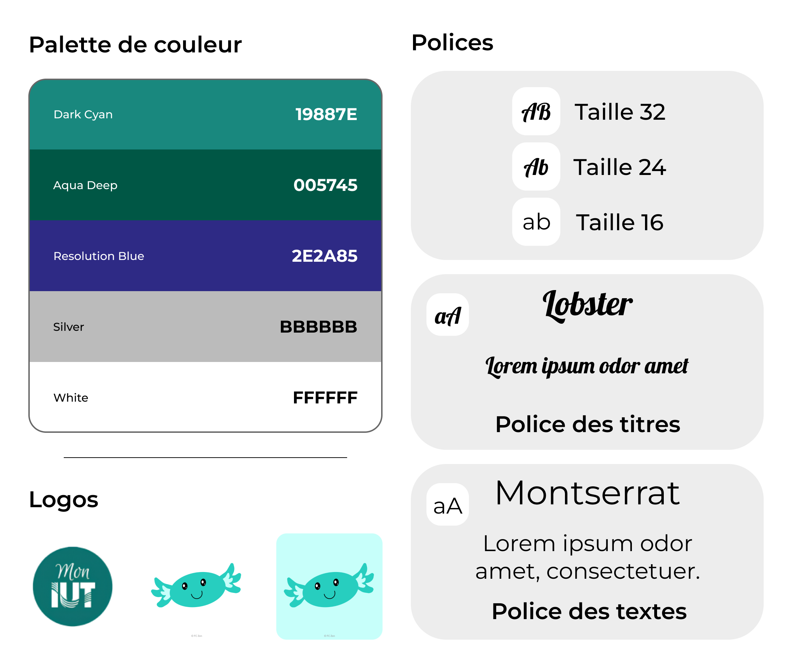

# ChillZone (Mon IUT)

<p align="center">
    
</p>

**Projet SAE (Situation d’Apprentissage et d’Évaluation) en collaboration avec un Projet TIPI (Technologies de l’Information et Patrimoine Immobilier)**  
_Optimisation des espaces universitaires et amélioration de l'expérience utilisateur à l'IUT de Marne-la-Vallée._

## Présentation du Projet

Le projet **ChillZone** (déployé sous le nom **Mon IUT**) est une application conçue pour simplifier la vie quotidienne des étudiants et du personnel universitaire, tout en offrant aux équipes administratives et aux prestataires de restauration un outil de gestion performant.

Développé en partenariat avec le **CIPEN** (Centre d’Innovation pour la Performance et l’Environnement Numérique) et l'**IUT de Marne-la-Vallée (Université Gustave Eiffel)**, ce projet vise à moderniser les processus administratifs et à optimiser l'occupation des infrastructures du campus.

L'écosystème comprend deux volets complémentaires :

- **Une application mobile multiplateforme** destinée aux étudiants et aux enseignants.
- **Un back-office web** dédié aux administrateurs d'établissement, super-administrateurs et restaurateurs.

## Périmètre Fonctionnel

### 📱 Application Mobile (Étudiants et Enseignants)

- **Emploi du temps et calendrier** : Synchronisation avec l'emploi du temps universitaire via l'intégration d'un lien ICAL / ADE.
- **Réservation d'espaces** : Consultation des disponibilités et réservation de salles de travail ou de box acoustiques. Validation de présence, annulations et signalements d'incidents.
- **Restauration en Click & Collect** : Commande de repas auprès du CROUS, de frigos connectés ou de food-trucks partenaires. Génération d'un QR code pour le retrait rapide.
- **Plan interactif** : Orientation 2D au sein de l'établissement par bâtiment et par étage.
- **Services et actualités** : Notifications de rappel, accès à la FAQ de l'établissement et consultation des réseaux officiels.

### 🖥️ Back-Office Web (Administrateurs et Restaurateurs)

- **Tableaux de bord et statistiques** : Analyse de l'occupation des salles, du nombre de réservations mensuelles et du suivi de la fréquentation.
- **Administration de l'établissement** : Gestion des comptes utilisateurs, modération, blocage préventif et mise à jour des cartes et points d'intérêt.
- **Gestion de la restauration** : Gestion des catalogues de produits, paramétrage des menus, gestion des stocks en temps réel et suivi des commandes.

## Cadre Académique et Suivi de Projet

Ce projet a été réalisé sur une année académique complète (d'octobre à mars) par une équipe de six étudiants en troisième année de BUT Informatique à l'IUT de Marne-la-Vallée.

### 📅 Organisation et Méthodologie Agile

L'équipe a appliqué la méthodologie **Agile (Scrum)** découpée en itérations courtes (sprints) pour répondre aux exigences évolutives de la Maîtrise d'Ouvrage (MOA).

- **Planification et suivi** : Utilisation de la suite **Atlassian (Jira / Confluence)**. Au total, le projet a totalisé 69 User Stories réparties dans 8 Epics et plus de 207 tickets Jira.
- **Comitologie** : Organisation de sessions régulières de _Sprint Planning_, _Stand-up meetings_ documentés, _Poker Planning_ et _Rétrospectives de Sprint_.
- **Répartition des rôles** : Chaque membre de l'équipe a occupé un rôle principal doublé d'un rôle de secours (backup) afin d'assurer la continuité des développements :
  - **Cheffe de projet** : Helena CHEVALIER
  - **Responsable Back-End** : Kellian BREDEAU
  - **Responsable Front-End** : Elias LAHLOUH
  - **Responsable UI/UX Design** : Thivakar JEYASEELAN
  - **Responsable Tests (VVT)** : Taha SEFOUDINE
  - **Responsable Documentation** : Loïc MAURITIUS

### ✅ Qualité, Validation et Tests Utilisateurs

Afin de garantir l'adéquation de la solution avec les besoins réels du campus et de valider l'expérience utilisateur (UX/UI), l'équipe s'est appuyée sur des protocoles de qualification ciblés :

- **Revue de code stricte** : Intégration sur GitHub soumise à des _Pull Requests_ (PR). Chaque PR devait être relue et approuvée par au moins un réviseur avant d'être fusionnée sur la branche principale.
- **Tests Utilisateurs** : Réalisation de campagnes de tests d'ergonomie et d'usage auprès des étudiants de l'IUT pour évaluer l'intuitivité des parcours (réservation de box, commande de repas, etc.) et valider les fonctionnalités de l'interface mobile.
- **Environnement de test** : Expérimentations mobiles réalisées en conditions réelles d'utilisation via **Expo Go** pour tester les interactions tactiles et les performances sur smartphone, couplées à un déploiement temporaire sous **Docker**.

## Maquette du projet

Le design a été intégralement refait et réinventé pour le rendre plus moderne, accessible (contraste, icones, etc...) et cohérent avec le message du projet.



<br>

Le mockup a été réalisé sur Figma et est disponible en ligne pour consultation et interaction. Vous pouvez visualiser le prototype interactif par ce lien : <a href="https://www.figma.com/design/9VvHixm0ELnijDbcBnDAep/ChillZone?node-id=0-1&t=8qqqns2O4uL0Gop5-1">Maquette</a>.
Il est possible de visualiser les 2 formats également (<a href="https://www.figma.com/proto/9VvHixm0ELnijDbcBnDAep/ChillZone?node-id=47-39&p=f&viewport=403%2C121%2C0.08&t=xpohQjXASzvIaszb-1&scaling=min-zoom&content-scaling=fixed&starting-point-node-id=47%3A39&show-proto-sidebar=1&page-id=0%3A1">Téléphone</a>, <a href="https://www.figma.com/proto/9VvHixm0ELnijDbcBnDAep/ChillZone?node-id=1000-5186&viewport=-42%2C1760%2C0.28&t=aBxAvvBIkOwFJ6BT-1&scaling=min-zoom&content-scaling=fixed&starting-point-node-id=992%3A4054&show-proto-sidebar=1&page-id=396%3A981">Ordinateur</a>)

## Architecture Technique

Le projet repose sur une architecture découplée organisée selon la méthode **Atomic Design** pour le développement des interfaces.

```
ChillZone/
├── api-django/          # API REST & Gestion de la base de données (Python / Django)
├── react-web/           # Interface d'administration Web (React / TypeScript)
└── react-mobile/        # Application Mobile (React Native / Expo)
```

| Composant            | Technologie                    | Rôle / Description                                                     |
| :------------------- | :----------------------------- | :--------------------------------------------------------------------- |
| **Back-End**         | Python / Django REST Framework | Gestion des endpoints RESTful, sécurisation, gestion des rôles et ORM. |
| **Base de Données**  | MySQL 8.0                      | Modèle relationnel comportant 42 tables.                               |
| **Front-End Web**    | React / TypeScript             | Back-office responsive pour administrateurs et restaurateurs.          |
| **Front-End Mobile** | React Native / Expo            | Application mobile native iOS et Android.                              |
| **Conteneurisation** | Docker                         | Normalisation de l'environnement d'exécution.                          |

## Installation et Déploiement Local

### Prérequis

- Node.js (v18+)
- Python (v3.10+)
- Serveur MySQL
- Expo Go (installé sur un terminal mobile)

### Procédure d'installation

1. **Cloner le dépôt Git :**

   ```bash
   git clone https://github.com/FC-Zen/ChillZone.git
   cd ChillZone
   ```

2. **Lancer le serveur Back-End (Django REST API) :**

   ```bash
   cd api-django
   python -m venv venv
   source venv/bin/activate  # Sur Windows: venv\Scripts\activate
   pip install -r requirements.txt
   python manage.py migrate
   python manage.py runserver
   ```

3. **Lancer le Back-Office Web (React) :**

   ```bash
   cd ../react-web
   npm install
   npm start
   ```

4. **Lancer l'Application Mobile (React Native / Expo) :**

   ```bash
   cd ../react-mobile
   npm install
   npx expo start
   ```

   _Scannez le QR Code affiché dans le terminal avec l'application Expo Go pour exécuter le projet sur votre mobile._

## Encadrement Académique

<p align="center">
    
</p>

- **Établissement** : IUT de Marne-la-Vallée — Université Gustave Eiffel
- **Département** : Informatique (BUT3)
- **Enseignant Référent** : M. Olivier CHAMPALLE
- **Porteurs de Projet (MOA - CIPEN)** : Mme Juliette CLAISSE, Mme Rada MOGLIACCI

---

<h3 style="text-align:center;">Toute l'équipe ChillZone vous remercie de votre soutien !</h3>
<h5 style="text-align:center;">Copyright @FC-Zen</h5>
<p align="center">
    
</p>
