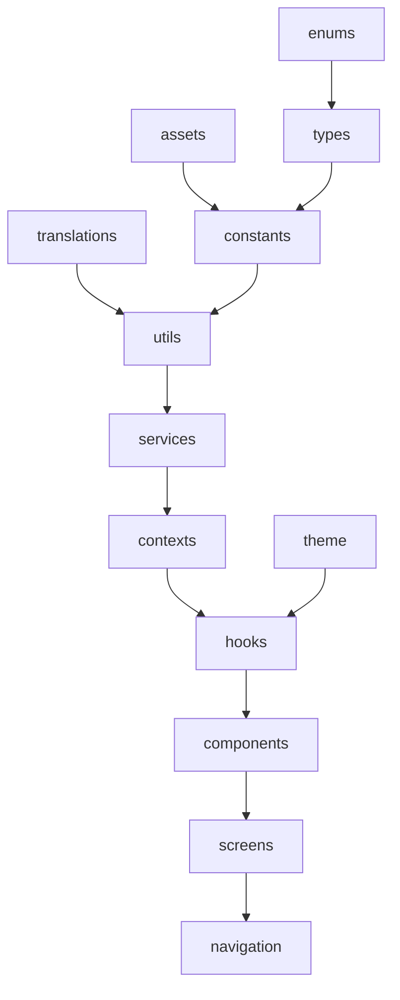

# Architecture de l'application

Depuis x dossier, je n’ai pas le droit d’importer le dossier y.
 
Depuis assets, je n’ai pas le droit d’importer enums, constants, translations, utils, types, services, contexts, theme, hooks, components, screens, navigation
 
Depuis constants, je n’ai pas le droit d’importer translations, utils, services, contexts, theme, hooks, components, screens, navigation
 
Depuis translations, je n’ai pas le droit d’importer assets, enums, constants, utils, types, services, contexts, theme, hooks, components, screens, navigation
 
Depuis utils, je n’ai pas le droit d’importer services, contexts, theme, hooks, components, screens, navigation
 
Depuis types, je n’ai pas le droit d’importer constants, translations, utils, types, services, contexts, theme, hooks, components, screens, navigation
 
Depuis services, je n’ai pas le droit d’importer contexts, theme, hooks, components, screens, navigation
 
Depuis contexts, je n’ai pas le droit d’importer theme, hooks, components, screens, navigation
 
Depuis theme, je n’ai pas le droit d’importer enums, constants, translations, utils, types, services, contexts, theme, hooks, components, screens, navigation
 
 
Depuis hooks, je n’ai pas le droit d’importer components, screens, navigation

Depuis components, je n’ai pas le droit d’importer, screens, navigation